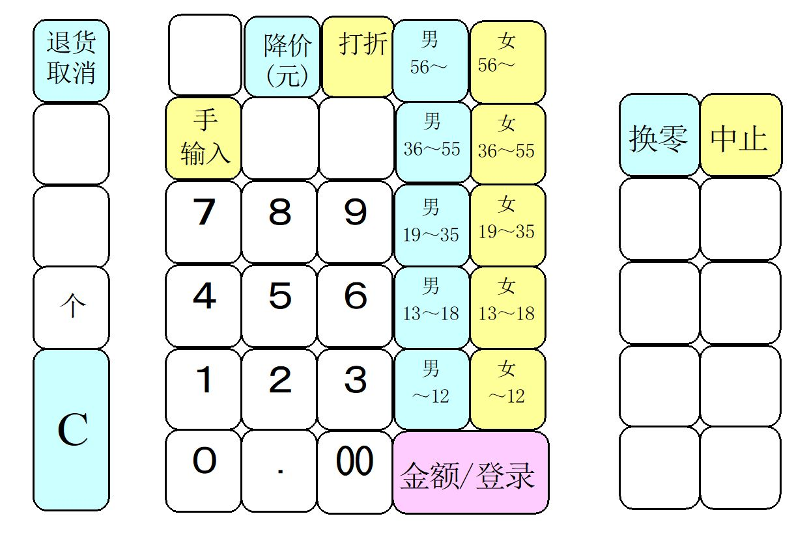

# 对京东的几点思考

## Introduction

京东零售集团，是集团垂直的业务，将to B & to C的业务打包在一起，整体提升业务增量，找到更好的转化路径

* 工作流程：规划--&gt;识别机会--&gt;涵盖全流程
* 所需技能：商业敏感度，有用户研究和分析基础，对业务有整体的理解
* C端客户：一个产品已经卖的挺好的，通过分析销售数据、用户点击行为等，
* B端客户：了解分析不同的商家，给入驻京东的商家给予资源支持
* 品牌：引入新品牌，并进行推广



* 文章划重点：前台部门旨在围绕C端和B端客户建立灵活、创新和快速响应的机制。
* 个人总结：就是通过大数据分析，把合适的东西带给需要的人

## Concept explanation

针对目前火热的新零售，主要存在三个问题：

1. 解读什么是新零售
2. 分析潜在的市场价值
3. 实际应用场景；

#### 1. 什么是新零售

从本人角度来看，什么是零售？为什么会出现新零售？

首先，如何理解零售？零售是指区别于批发业务，零售点面对的终端消费者，以售卖小额数商品为主；

那什么是新零售呢？首先，我们先看这样一幅图，这是一张传统便利店的收银机面板布局。很多日系便利店用的都是这种布局。

显而易见，和常见收银机最不同的部分，是一大排男女12~56的数字键，这部分便利店系统称之为「 **客层键**」。收银员必须要靠人眼识别顾客的男女年龄，再按下这些「 客层键」，以便来为顾客打上标签。

此收银机面板布局通过引入用户年龄判断机制，日后在进行「购物篮分析」时，这个客层信息会成为一个重要字段，转门用于归纳总结并推测不同年龄段用户的消费偏好。

而现在流行的线上销售，是天然带有此数据获取优势的：

* 你的收件地址=&gt;地区消费行为分析
* 你是否对促销敏感=&gt;促销关联分析
* 你搜索过什么，浏览过什么=&gt;用户兴趣爱好分析

通过每一个顾客的浏览记录以及消费记录，可以精准绘画出每一位购买人的用户画像，然后通过「猜你喜欢」「有XX人浏览过此商品」「XX人推荐的品质好货」等等，给用户推送相关信息，大幅度提高了商品点击购买率

那再回头来回过头来看，目前用户购买零售商品存在的一般场景主要为线上与线下： 

* 线下：3公里范围内去买个东西，来回2个小时；
* 线下：1公里范围内去买个东西，来回1小时；
* 线上：线上购买，运输2-3天（京东物流24小时之内）

=&gt;思考总结：能否通过借助新的物流技术、数据整合能力、商品服务质量，用最少的时间，用户付出最少的努力拿到想要的产品？

因此个人认为，想要找到零售活动的新突破点，重点是将购物场景中的三要素——场（景）、货（或服务）、人（或机构），对各个要素节点进行新的需求点挖掘。

而新零售，就是**有线下店，通过线上买东西（更快的）送到家**

## Discussion

零售面向的场景千变复杂，本讨论环节以一现实场景为切入点，分析该场景下产生的用户交互行为与对应痛点，并思考其痛点解决方案，为零售提供一些个人的看法（仅供个人复盘，no offense）。

### **线下场景**

用户在逛商场时，经常会自己避人眼光，悄悄看吊牌，然后用手机拍照，在线上平台搜索同款

### **用户需求分析**

从根本上来说，此时的用户已经通过在线下店的体验，对商品品质和设计有了真实的感受，并已经对该产品产生了兴趣，甚至购买冲动，才会发生「吊牌拍照」的行为，而用户的核心目标是希望以最低的价格买到性价比最高的商品

### **产品方需求分析**：

* _已有线下店的品牌_：
  * 优点：线下门店，主要扮演成为消费者体验的可感空间的角色，以看得见摸得着的体验经历，形成和建立品牌与终端消费者之前的信任关系形
  * 缺点：开设品牌店对企业来说需要投入大量的成本，比如时间成本（购买商铺交涉时间、装修时间）+ 固定资产投资成本（商铺购买或租赁成本）+ 员工管理成本（导购员的工资支付）+ 销售费用（如水电费）
* _未开设线下店的品牌_：
  * 优点：目前许多品牌在创立初期会选择在京东这样的第三方平台上开店，相比线下开店，能以最少的时间成本与固定资产投资成本接触到最大数量级用户，并快速打开消费者市场
  * 缺点：纯线上店在初期，小店铺模式相对来说不利于“品牌化“的塑造，而当一个商品趋向品牌化，商业机构可能不会过度依赖集中式的线上市场，企业会更加倾向于拥有自己的网站，第三方其实像

### **解决方案思考**

京东作为第三方网上综合购物商城，在线上流量越来越贵的当前，如何通过新零售的手段和方式，使三方受益？在此，本人认为京东可以开设基于线下体验店的「京东超市」，从商品类目的丰富度上来讲，可以把它想像成莱奥，从线下店的开设目标上来讲，可以结合苹果线下店，换句话说，是一个拥有极致线下体验的商场。

此线下体验店以拍卖展厅的形式，有以下几个特点：

* 以拍卖展厅的形式，使线上京东商场里的店铺或品牌公开竞价，不同展位起步价不同，价格者得；
* 展厅的目的：主要做产品展示、体验、售后（包括维修与退换货），可能不再承担首要销售渠道；京东甚至可以和品牌方合作，在体验店的展厅里，所有的产品吊牌上都附有二维码，扫描二维码可以直接引导用户打开京东商场里的该商品详情页，引导消费者进行_购物_，通过物流送货完成对产品的完整体验，打通用户的购物闭环
* 线下体验，线上购买
* 京东自营+京东超市：借助京东强大的物流系统，**直接解决最后一公里配送**
* 结合大数据分析：在每个展位上做埋点，通过分析不同展区的人流量、用户在不同展区停留的时间长短、某个具体商品的停留时间等，为京东绘制精准用户画像与制定运营策略提供数据基础与解决方案；
* 高科技加持的体验：如针对服装类展区，推出智能试衣镜，消费者可以与其进行互动，并能为用户提供试穿数据与建议（如该用户的肤色偏白，同款紫色会更适合您，您的体型非常匀称，可以再试穿小一号，使您看起来身材更加好等，类似的还有丝芙兰AR试妆魔镜）

优势分析：

* 对用户来说：享受更好的产品体验，包括产品的试用、售后退换货等
* 对品牌来说：尤其是对新型品牌来说，比自己每到一个新城市重新进行一次地铺要节约许多成本；并且可以根据每个展区
* 对京东来说：通过开设展位的方式，收取展位佣金，并根据季节变化和实时热点变化，吸引更多的用户

## 更多思考

体验官：针对个体和个体之间的信任难以建立的问题，引入一个第三方（比如商品体验官，直播博主），相对于售卖博主的信任关系，向粉丝售出商品，进行导流。商品体验官会优先体验各个品牌的新产品和新特性，输出体验评测报告，反馈意见和建议，通过全面、深度的产品评测，为用户提供购买建议等

