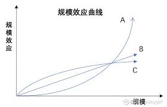

# 规模效应与马太效应

## 规模效应

### 1. 定义

机械化生产时代：在一定的产量范围内，产量越高，平均成本越低

互联网时代：销量/用户量/客户量足够大之后（与规模小的竞争对手比）所产生的 i\)用户体验优势以及 ii\)成本优势，具体是成本优势还是客户体验优势取决于具体的生意模式

这个定义有两个层面：1）不同生意之间的规模效应；2）同一个生意不同公司之间的竞争

_**Question：用户量和客户量的区别是什么？**_

### 2. 规模效应曲线的形状

A：指数增长，formula：Values=w \* X^2（X为节点数）；案例：社交网络

_**Question: 为什么中国只有微信和QQ，但国外有WhatsApp，messenger，snapchat等多个聊天软件？**_

B：线性；案例：淘宝（也是双边网络，但不存在负向竞争）

C：对数；性质：双边网络且同边负向竞争，案例：打车软件，外卖软件。

### 3. 要素的规模效应

#### a. 行业的选择

比如外卖行业、打车行业，超市

在一个行业里，选择自营or加盟？龙头企业可将有规模效应的要素掌握在母公司手里，比如711的选品、系统、供应链等；加盟商只能从711定义好的产品库里选。又比如外卖行业产品研发掌握在母公司手里，配送业务这些可以发展多加盟商

#### b. 产品研发效应

产品研发成本，平摊到每一个订单上要花多少钱，是否能达到生存的门槛

#### c. 资本的规模效应

多少钱的投资？投太多了浪费钱，投太少了没有竞争力

## 马太效应

定义：可以理解成两极分化效应，好的越好，差的越差

如果一个事情一开始什么都完美，你的竞争对手还没有脱颖而出，那说明你进入了一个错误的行业

马太效应的作用：在没有有效信息、知识结构和判断方法决策一个领域未来的发展时，可以依赖马太效应，尽可能得抓住有规模效应的要素，尽可能减少反规模效应，尽快形成马太效应。（比如拿到风投，产生光环，从业者投简历产生人才优势，又吸引投资者拿到下一轮融资，以正反馈的循环形成马太效应）

应用：年轻人如何选择创业公司？答：看风投

## 思考题

_Question：为什么中国的很多品牌都以直营为主，即使这是反规模效应的？_

_Answer：可能是因为中国的行业还未成熟，一个行业的成熟就意味着能犯的错误越来越少，任何一个错误都会被放大成为失败的原因。_

