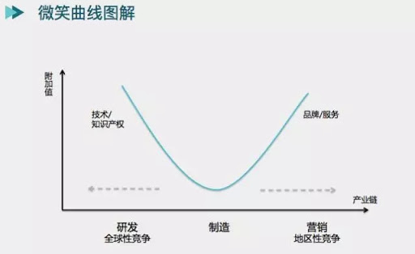

# 战略

## 定义的理解

在面对多个业务的多个选择时，ROI投资产出比最高

### 市场空间

如何判断市场体量？

1. 现有的行业体量和增速根据进行拟合，并且随着行业的发展不断地对其再拟合
2. 类比：比如日本社会里提供社会化餐饮解决方案的是便利店，所以可以根据日本便利店的市场体量来测算外卖的市场体量

### 竞争格局

A指数级行业：1家，比如社交网站的微信

B线性：2-3家（淘宝京东，外卖行业）

C对数：一般不超过7家（长视频烧钱最惨烈）

PS：大行业小企业的例子也是很多的，比如说中国的餐饮行业。

根据迈克波特理论，企业竞争的3要素就是成本领先、差异化和专注。如果行业里有有很多家，那企业经营的关键战略是差异化；如果只有两三家，很难差异化。比如美团饿了么

### 产业链

微笑曲线理论：在一个产业里生存最好的就是处在产业链里最上游接近核心攻击资源和最下游接近消费者的企业（解释链条比较长的行业）

上下游之间的关系：对一家公司而言，最好的情况是上下游集中度都很分散，但你的集中度高。

_**为什么？因为议价能力高**_

